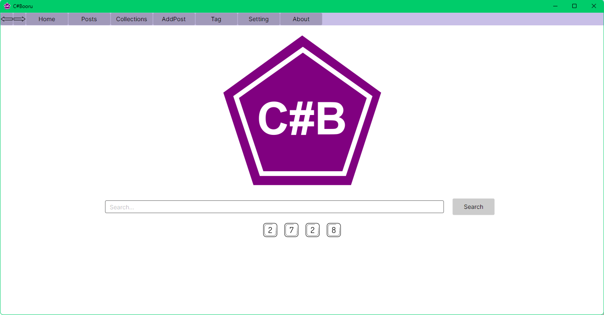

### C#Booru

C#Booru is a lightweight, cross‑platform image management application inspired by the structure and workflow of traditional boorus.
It is built with C# and Avalonia, and uses a SQLite embedded database to store posts, tags, and collections efficiently.

### Targetted platforms

|Platforme|Status|
|-|-|
|Windows X64|✅|
|Linux Binary X64|✅|

**Linux Binary**
*VLC and the .NET 9.0 SDK must be installed to use the application.*

